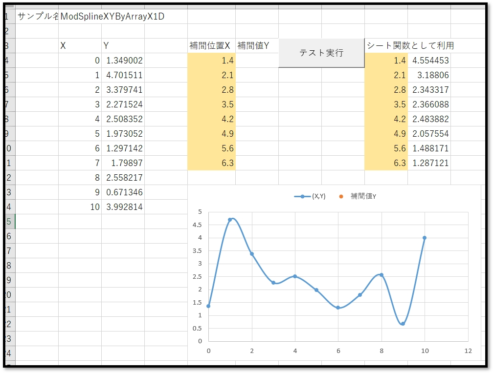
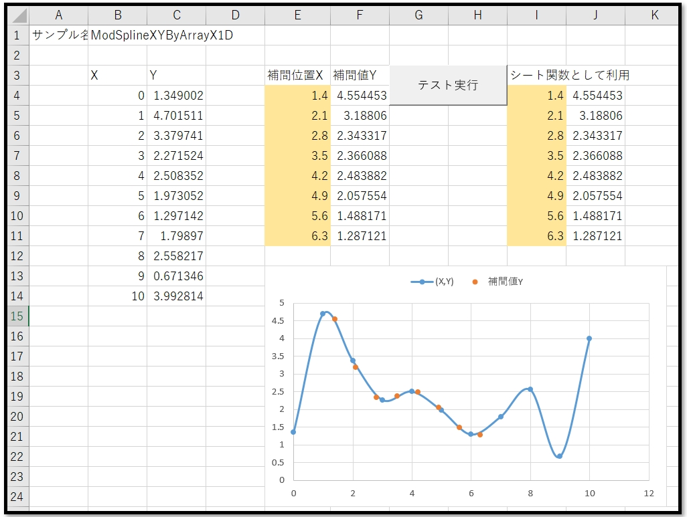
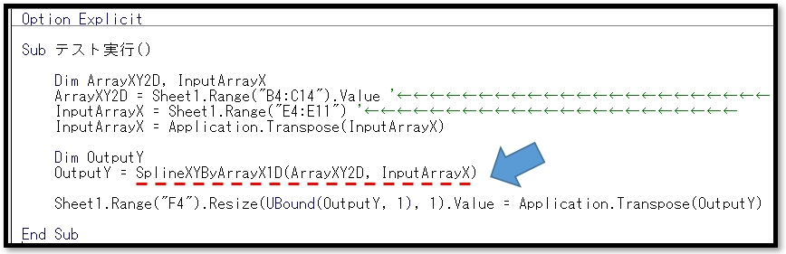

# VBA-SplineXYByArrayX1D
- License: The MIT license

- Copyright (c) 2021 YujiFukami

- 開発テスト環境 Excel: Microsoft® Excel® 2019 32bit 

- 開発テスト環境 OS: Windows 10 Pro

実行環境など報告していただくと感謝感激雨霰。

# 説明
二次元配列（X,Y）において指定値Xの一次元配列におけるそれぞれの要素のスプライン補間値Yを一次元配列で出力する。

## 活用例
配列を用いることで、スプライン補間計算が一括でできる。

# 使い方
実行サンプル「Sample-SplineXYByArrayX1D.xlsm」の中の使い方は以下の通り。

サンプル中身

セル[B4:C14]がスプライン補間対象の二次元配列

セル[E4:E11]に補間の指定値Xの一次元配列

「テスト実行」ボタンを押した後

セル[F4:F11]に補間値Yの一次元配列が出力される。

またセル[J4:J11]にはプロシージャ[SplineXYByArrayX1D]がシート関数(配列関数)としての使用例で入力してある。

プロシージャ中身

プロシージャ「SplineXYByArrayX1D」が使われている。

引数は

-  ArrayXY2D       補間対象の二次元配列（X,Y）

-  InputArrayX     補間の指定位置Xの一次元配列

## 設定
実行サンプル「Sample-SplineXYByArrayX1D.xlsm」の中の設定は以下の通り。

### 設定1（使用モジュール）

-  ModTest.bas
-  ModSplineXYByArrayX1D.bas

### 設定2（参照ライブラリ）
なし

